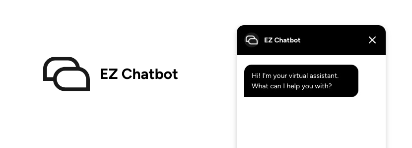

# EZ Chatbot

Custom chatbot for your website using the OpenAI API.



## Features

- Custom chatbot with your own knowledge base.
- Customizable appearance.
- Save user conversations on your Wordpress database.
- Download conversations as CSV file.

## Installation

- Download `ez-chatbot.zip` from the [releases page](https://github.com/medinnna/ez-chatbot/releases).
- Go to **Plugins** on your WordPress admin panel.
- Select **Add new plugin**.
- Select **Upload plugin** and choose the downloaded file.
- Click **Install Now**.

## Build/Development

- Clone the repository:

```sh
git clone https://github.com/medinnna/ez-chatbot.git
```

- Install the dependencies.

```sh
npm install
```

- Build the plugin.

```sh
npm run build
```

The build automatically creates the plugin zip file in the `dist` folder only with the necessary files.

## License

EZ Chatbot is licensed under the [GPL v3 or later](https://www.gnu.org/licenses/gpl-3.0.html).
