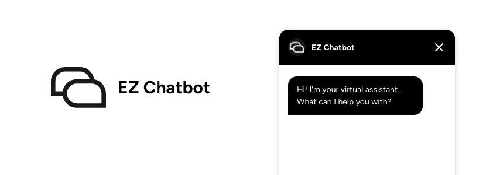
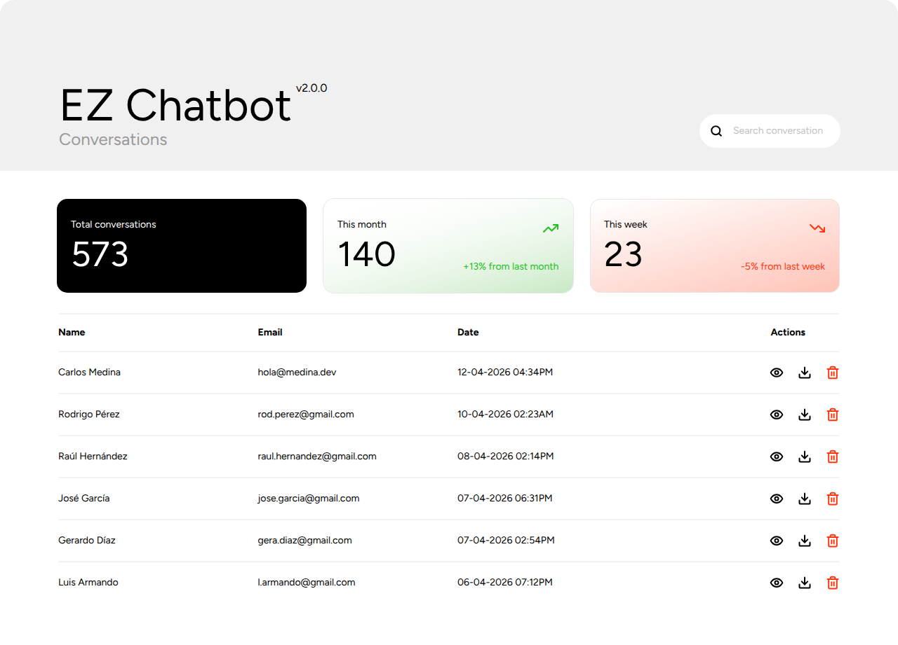

# EZ Chatbot

WordPress plugin that integrates a personalized AI chatbot into your website.



## Features

- 🤖 **Custom AI Chatbot:** Powered by your own knowledge base to deliver smart, tailored replies.
- 🎨 **Customizable UI:** Style it your way with live preview.
- 💾 **Conversation Storage:** Saves chats directly to your WordPress database.
- 📥 **CSV Export:** Download conversations anytime.
- 🔍 **Search:** Quickly find chats by name or email.
- 📊 **Analytics:** Total, monthly and weekly stats with trend insights.
- 🔗 **Webhooks:** Connect with your favorite external services.

<br>



## Installation

- Download `ez-chatbot.zip` from the [releases page](https://github.com/medinnna/ez-chatbot/releases).
- Go to **Plugins** on your WordPress admin panel.
- Select **Add new plugin**.
- Select **Upload plugin** and choose the downloaded file.
- Click **Install Now**.

## Build/Development

- Clone the repository:

```sh
git clone https://github.com/medinnna/ez-chatbot.git
```

- Install the dependencies.

```sh
npm install
```

- Build the plugin.

```sh
npm run build
```

The build automatically creates the plugin zip file in the `dist` folder only with the necessary files.

## License

EZ Chatbot is licensed under the [GPL v3 or later](https://www.gnu.org/licenses/gpl-3.0.html).
